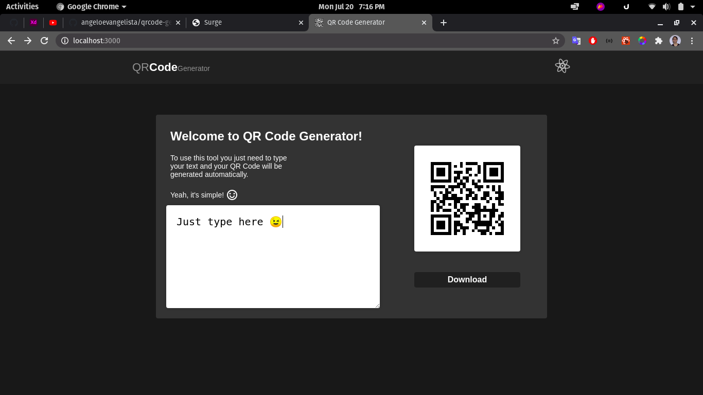

<h1 align="center">

  
</h1>

<h3 align="center">
  QR Code Generator
</h3>

This is a very nice QR Code Generator to intelligent and curious people 😝

### See a preview...
#### It's in real time

### But you can also test by yourself <a href="http://qrcode-generator.surge.sh">here</a> ;)

##### Unfortunately this preview isn't loading the styles... but I'm trying to fix that 